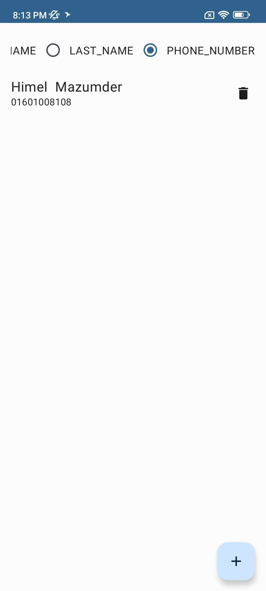
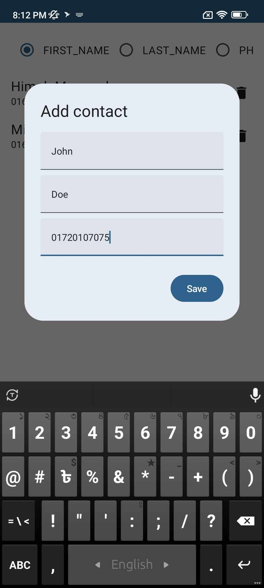
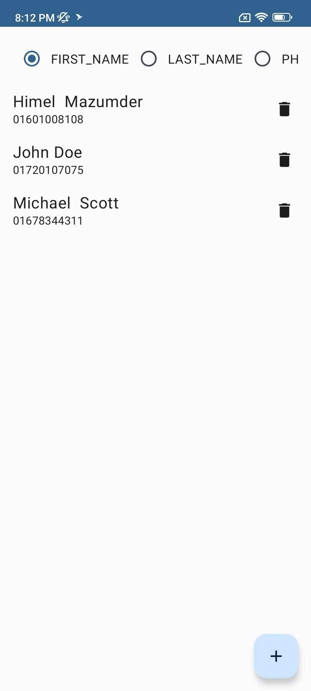
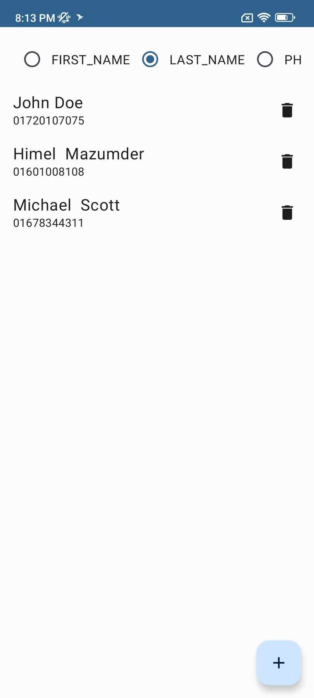
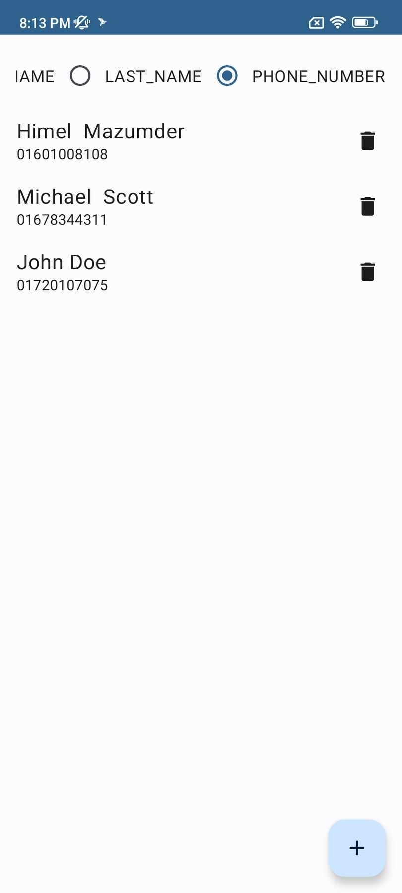

# Jetpack Compose Contact APP using Room-DB
## APK file to download in the root directory
<a href="app-debug.apk">app-debug.apk</a>

## Screenshots:
Normal screen:  

Add contact:  

Sort by First Name:  

Sort by Last Name:  

Sort by Phone Number:  

